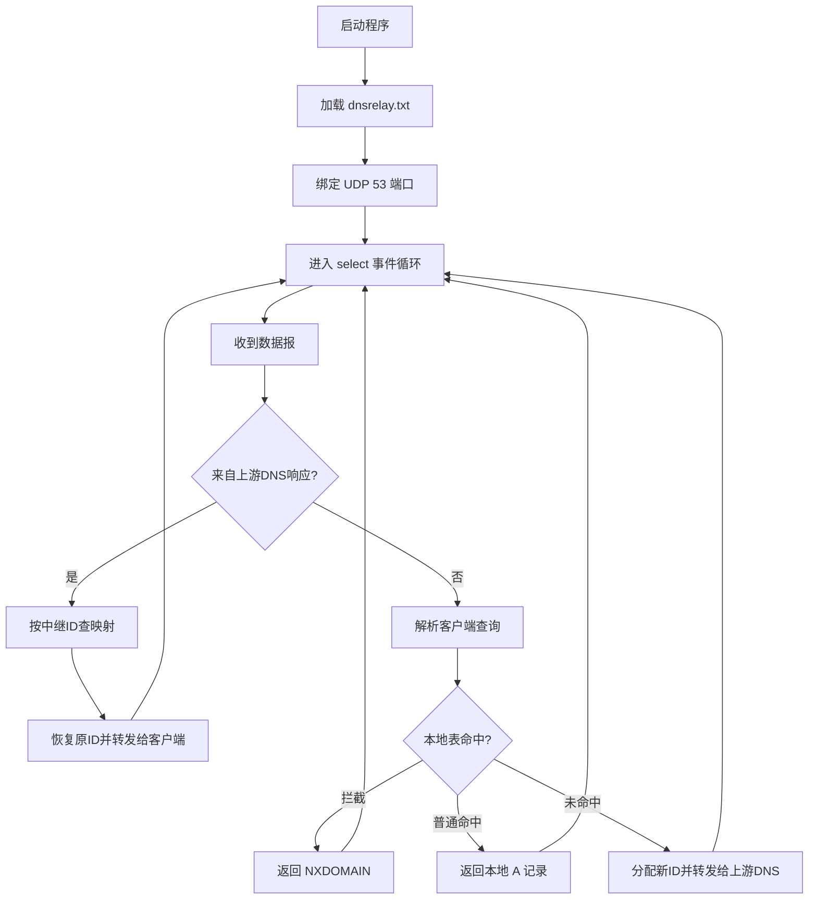

# 课程设计报告提纲

这份提纲就是按老师 PPT 里的要求整理的，可以直接拿来写报告。

## 1. 课题背景与目标

- DNS 的作用与基本流程
- 本次课程设计要实现的 3 个核心功能
- 老师要求重点解决的问题：并发、超时、ID 转换

## 2. 系统功能设计

建议写成 3 个基础功能 + 2 个增强点：

1. 本地域名解析
2. 本地域名拦截
3. 上游 DNS 中继
4. 多客户端并发处理
5. 超时与迟到响应处理

## 3. 模块划分

建议按现在的工程结构写：

1. `dnsrelay.c`
   - 参数解析
   - 初始化 Winsock
   - 创建并绑定本地 UDP socket
   - `select()` 事件循环
2. `dns_protocol.c`
   - 解析 DNS 问题段
   - 构造本地响应报文
3. `domain_table.c`
   - 加载配置文件
   - 本地查表
4. `relay_engine.c`
   - 分配中继 ID
   - 保存 TID 映射
   - 转发到上游 DNS
   - 处理超时和迟到响应

## 4. 软件流程图

可以按下面逻辑画图：

## 5. 关键数据结构设计

这里建议重点写两个结构：

1. DNS 报头结构体
2. TID 映射结构体

说明每个字段的作用，尤其是：

- `id`
- `qr`
- `rcode`
- `qdcount`
- `ancount`
- `upstream_id`
- `client_id`
- `timestamp`

## 6. 关键算法说明

建议分别说明：

1. 本地查表算法
2. DNS QNAME 解析算法
3. 本地响应构造算法
4. ID 转换算法
5. 超时清理算法

## 7. 测试用例与运行结果

直接参考 `docs/TEST_CASES.md`。

这里一定要放：

- 测试命令
- 截图
- 预期结果
- 实际结果

## 8. 调试中遇到的问题及解决

建议至少写下面这些：

1. 53 端口绑定失败
2. 只写成单文件导致结构混乱
3. 原来同步等待上游响应，不能真正并发
4. 上游 DNS 超时后如何处理
5. 迟到响应如何识别并丢弃

## 9. 总结与体会

每个成员都写一点：

- 对 DNS 报文结构的理解
- 对 UDP 和超时处理的理解
- 对 `select()` 多路复用的理解
- 对工程化拆分模块的理解
