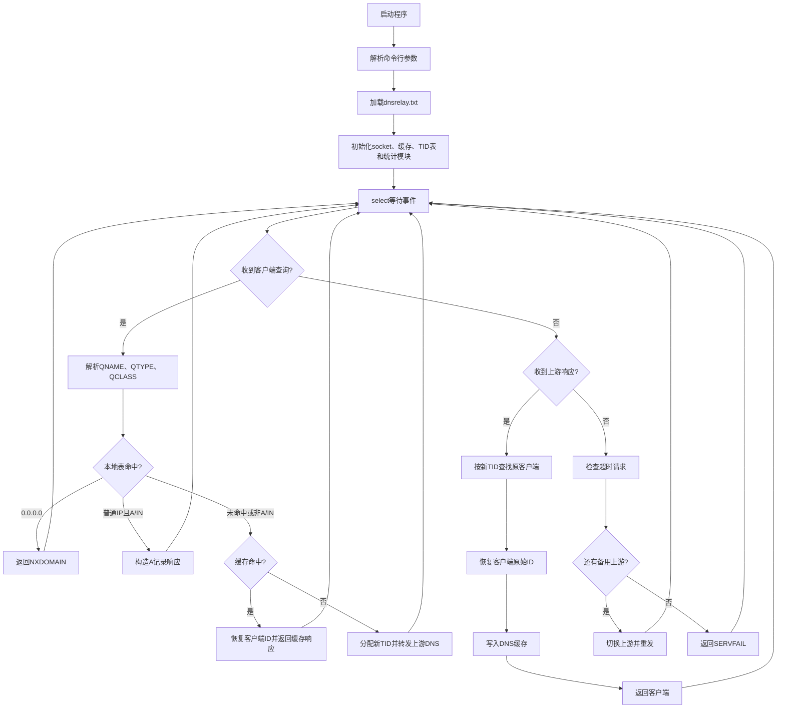
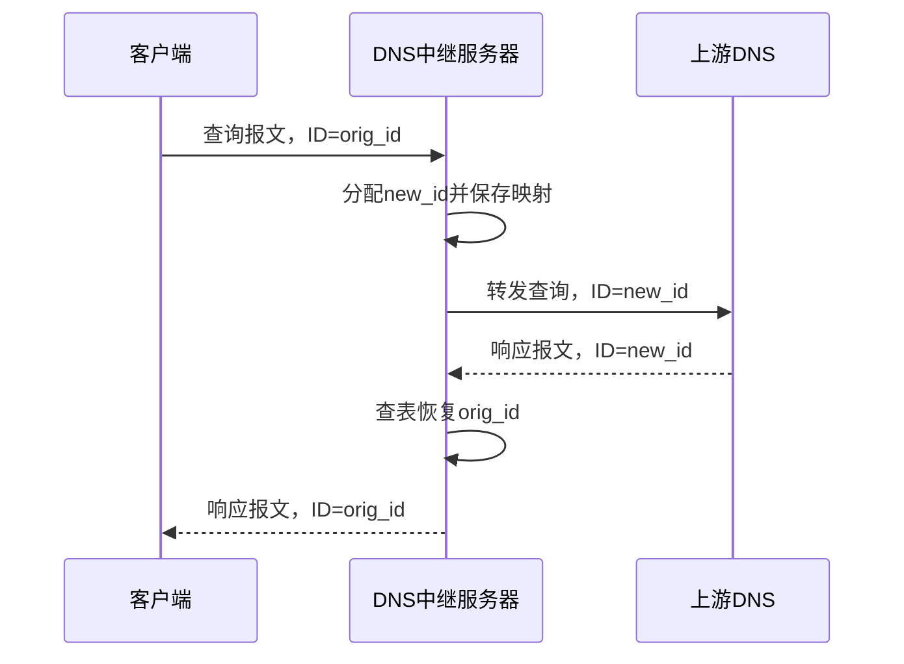

# 计算机网络课程设计报告 - DNS中继服务器

## 一、课程要求与实现概述

根据课程设计PDF中“DNS中继服务器”的要求，本题需要设计一个DNS服务器程序，读入“IP地址-域名”对照表，并在客户端查询域名时完成三类处理：

1. 表中命中 `0.0.0.0`：向客户端返回“域名不存在”的错误消息，实现不良网站拦截。
2. 表中命中普通IP地址：直接向客户端返回该IP地址，实现本地DNS服务器功能。
3. 表中未命中：向外部DNS服务器查询，并把外部DNS响应返回给客户端，实现DNS中继功能。

课程PDF还强调两个必须考虑的问题：

1. 多客户端并发：第一个查询尚未返回时，程序仍要能处理其他客户端查询，需要进行DNS消息ID转换。
2. UDP超时处理：外部DNS服务器可能无响应或迟到响应，程序需要处理超时，不能一直挂起请求。

本项目已经实现上述课程基本要求，并额外实现了DNS缓存、多上游DNS切换、日志文件、统计信息、Linux热重载和缓存清理等扩展功能。

### 1.1 课程基本功能

| 功能 | 实现情况 | 主要代码 |
| --- | --- | --- |
| 读取IP-域名对照表 | 支持 `IP 域名`，并兼容 `域名 IP` | `dns_table.c` |
| 普通IP本地解析 | A/IN查询命中普通IP时直接构造A记录响应 | `dns_relay.c`, `dns_packet.c` |
| 不良网站拦截 | 表中IP为 `0.0.0.0` 时返回NXDOMAIN | `dns_relay.c`, `dns_packet.c` |
| DNS中继 | 表中未命中时转发上游DNS | `dns_relay.c`, `upstream.c` |
| 多客户端并发 | 为上游查询分配新ID，响应返回后恢复原ID | `tid_map.c` |
| UDP超时处理 | 超时后重试备用上游或返回SERVFAIL | `dns_relay.c`, `tid_map.c` |
| 命令行参数 | 支持 `dnsrelay [-d|-dd] [dns-server-ipaddr] [filename]` | `dns_relay.c` |
| 非忙等待 | 使用 `select` 等待socket事件和超时tick | `dns_relay.c` |

### 1.2 扩展功能

| 扩展功能 | 说明 |
| --- | --- |
| DNS缓存 | 缓存上游成功响应，按TTL过期 |
| 查询类型隔离 | 缓存key为 `域名|QTYPE|QCLASS`，避免A和AAAA互相污染 |
| 多上游DNS | 支持逗号分隔多个上游，超时后自动切换 |
| 日志文件 | `-l <file>` 将主要日志写入文件 |
| 运行统计 | 统计总查询、本地命中、缓存命中、拦截、中继、超时、错误等 |
| Linux热重载 | Linux下支持 `kill -HUP <pid>` 重载域名表 |
| Linux清缓存 | Linux下运行时输入 `c` 清空DNS缓存 |
| 跨平台构建 | Windows使用Winsock，Linux使用POSIX socket |

## 二、系统功能设计

程序监听本机UDP 53端口，接收客户端DNS查询。每个查询先解析QNAME、QTYPE和QCLASS，然后按以下顺序处理：

1. 查本地域名表。
2. 如果命中拦截记录，返回NXDOMAIN。
3. 如果命中普通IP，且查询为A/IN，则直接构造A记录响应。
4. 如果命中普通IP但查询不是A/IN，例如AAAA、MX、CNAME，则转发上游DNS，避免错误返回A记录。
5. 如果本地表未命中，则先查DNS缓存。
6. 缓存命中时替换响应ID并直接返回客户端。
7. 缓存未命中时分配新的DNS事务ID，记录映射关系，并转发外部DNS服务器。
8. 收到上游响应后，根据新ID找到原客户端，恢复原始ID，写入缓存并返回客户端。
9. 如果上游长时间无响应，则触发超时处理；有备用上游则重发，全部失败则返回SERVFAIL。

这种处理方式保证了课程要求中的三类查询结果都能正确应答，同时兼顾了并发查询和UDP不可靠性。

## 三、模块划分

| 模块 | 文件 | 主要职责 |
| --- | --- | --- |
| 主控模块 | `dns_relay.c` | 命令行解析、socket初始化、主事件循环、查询分发、超时处理 |
| 公共定义 | `dns.h` | DNS结构体、常量、跨平台socket兼容、调试宏 |
| 域名表模块 | `dns_table.c/.h` | 加载对照表、处理UTF-8 BOM、兼容两种表格式、域名查找 |
| DNS报文模块 | `dns_packet.c/.h` | QNAME解析、问题区解析、本地响应、NXDOMAIN、SERVFAIL、TTL提取 |
| ID映射模块 | `tid_map.c/.h` | 保存新旧事务ID、客户端地址、原始查询、重试次数和时间戳 |
| 缓存模块 | `dns_cache.c/.h` | 缓存上游响应、TTL过期、缓存命中、缓存清空 |
| 上游模块 | `upstream.c/.h` | 维护上游DNS列表、IP解析、自动切换和恢复主上游 |
| 统计模块 | `stats.c/.h` | 记录并打印运行统计 |

## 四、软件流程图

### 4.1 主处理流程

### 4.2 ID转换流程

## 五、关键实现说明

1. 域名表加载
   - 默认提交表格式为 `IP地址 域名`，与老师参考实现一致。
   - 为了兼容测试，程序也支持 `域名 IP地址`。
   - 文件开头如有UTF-8 BOM，会自动跳过，避免第一行解析失败。

2. 本地解析和拦截
   - 普通IP只对A/IN查询直接返回A记录。
   - 拦截域名对A、AAAA等查询类型均返回NXDOMAIN。
   - 本地普通IP遇到AAAA、MX等非A查询时转发上游，避免不同类型结果混淆。

3. 并发ID转换
   - `tid_map_alloc` 分配新的上游ID，并保存客户端原始ID、地址和原始查询。
   - `tid_map_restore` 在收到上游响应时恢复客户端原始ID。
   - 该机制保证多个客户端并发查询时，响应不会串到其他客户端。

4. 非忙等待
   - 主循环使用 `select` 监听本地socket和上游socket。
   - `select` 设置1秒超时tick，用于检查TID超时和缓存过期。
   - 程序不会用死循环反复探测socket，因此避免CPU忙等待。

5. 超时处理
   - TID表记录每个转发请求的发送时间和重试次数。
   - 超时后如果存在备用上游，则切换上游并用原始查询重发。
   - 若所有上游都失败，则构造SERVFAIL响应发回客户端。
   - 测试中使用 `203.0.113.1` 等RFC保留TEST-NET地址作为测试黑洞，保证超时测试稳定可复现。

6. DNS缓存
   - 缓存完整上游DNS响应报文，而不是只缓存IP。
   - 缓存key包含域名、QTYPE和QCLASS，例如 `www.bupt.edu.cn|1|1`。
   - 返回缓存时只替换DNS响应头中的ID，保持答案区不变。

## 六、测试用例和运行结果

详细步骤见 `docs/详细测试文档.md`。本报告列出最终验收结果摘要。

| 编号 | 分类 | 测试目标 | 典型命令 | 结果 |
| --- | --- | --- | --- | --- |
| T01 | 基本 | Windows编译 | `.\build.bat` | 通过，生成 `dnsrelay.exe` |
| T02 | 基本 | 帮助参数 | `.\dnsrelay.exe --help` | 通过，输出Usage和默认上游 |
| T03 | 基本 | 默认配置加载 | `.\dnsrelay.exe -d 8.8.8.8 dnsrelay.txt` | 通过，加载198条记录并监听53端口 |
| T04 | 基本 | 本地普通IP命中 | `nslookup test1 127.0.0.1` | 通过，返回表中IP |
| T05 | 基本 | 不良网站拦截 | `nslookup 008.cn 127.0.0.1` | 通过，返回NXDOMAIN |
| T06 | 基本 | DNS中继 | `nslookup www.bupt.edu.cn 127.0.0.1` | 通过，日志出现RELAY和REPLY |
| T07 | 扩展 | DNS缓存 | 连续两次查询同一域名 | 通过，第一次CACHE PUT，第二次CACHE HIT |
| T08 | 扩展 | 查询类型隔离 | A、AAAA、A连续查询 | 通过，A和AAAA使用不同缓存key |
| T09 | 基本 | 多客户端并发 | `.\test_t09.bat` | 通过，多域名均有NEW TID和RESTORE TID |
| T10 | 基本 | ID转换 | 查询未命中域名 | 通过，日志显示NEW TID和RESTORE TID |
| T11 | 基本 | 单上游超时 | `.\dnsrelay.exe -d 203.0.113.1 dnsrelay.txt` | 通过，目标域名返回SERVFAIL |
| T12 | 扩展 | 多上游切换 | `203.0.113.1,114.114.114.114` | 通过，先Failover后成功响应 |
| T13 | 基本 | 命令行参数 | 默认、`-d`、`-dd`、指定文件 | 通过 |
| T14 | 扩展 | 日志文件 | `.\dnsrelay.exe -d -l run.log 8.8.8.8 dnsrelay.txt` | 通过，日志写入文件 |
| T15 | 扩展 | 配置格式兼容 | `format-test.txt` | 通过，两种格式均能解析 |
| T16 | 扩展 | Linux运行时扩展 | `s`、`c`、`kill -HUP` | Windows未测，代码仅Linux启用 |

说明：

1. `nslookup` 会自动查询 `1.0.0.127.in-addr.arpa`，这是对 `127.0.0.1` 的反向解析，不影响主测试结论。
2. `nslookup` 输出中的 `服务器: Unknown` 是因为本地DNS服务器 `127.0.0.1` 没有配置反向名称，属于正常现象。
3. 中继查询出现 `非权威应答` 表示答案来自外部DNS，不是本地权威区，也属于正常现象。

## 七、调试中遇到并解决的问题

1. Windows编译失败
   - 问题：原实现使用 `inet_aton`，MinGW/Windows下不可用。
   - 解决：改为跨平台的 `inet_pton` 封装，并使用 `-lws2_32` 链接Winsock。

2. 配置表格式不一致
   - 问题：课程参考资料使用 `IP 域名`，旧表文件可能使用 `域名 IP`。
   - 解决：加载函数同时识别两种格式，提交表统一整理为 `IP 域名`。

3. UTF-8 BOM导致第一行解析异常
   - 问题：Windows编辑器可能在文本开头加入BOM，导致第一行IP识别失败。
   - 解决：读取每行时检测并跳过BOM字节。

4. 超时测试被网络透明DNS影响
   - 问题：使用不可达地址时，部分网络可能仍返回DNS结果，导致超时测试不稳定。
   - 解决：把RFC保留的TEST-NET地址作为测试黑洞，不实际发包，用于稳定触发超时和多上游切换逻辑。

5. 超时只清理ID，没有响应客户端
   - 问题：旧逻辑删除TID后客户端可能一直等待。
   - 解决：TID表保存原始查询，最终失败时构造SERVFAIL响应。

6. 缓存key过于简单
   - 问题：只按域名缓存会让A、AAAA等不同查询类型互相污染。
   - 解决：缓存key改为 `域名|QTYPE|QCLASS`。

7. PowerShell并发测试输出混乱
   - 问题：`Start-Job` 后台运行 `nslookup` 时，中文输出可能被PowerShell当作错误流显示。
   - 解决：改用 `test_t09.bat` 一键打开多个命令行窗口并发测试，截图更清楚。

8. 批处理中文注释解析问题
   - 问题：中文注释和换行格式可能导致 `.bat` 被cmd错误解析。
   - 解决：脚本增加 `chcp 65001`，命令改为 `cmd.exe /k "完整命令"`，并使用Windows换行格式。

9. 缓存开放寻址删除后的查找隐患
   - 问题：过期缓存删除后，如果查找遇到空槽就提前结束，可能漏掉后面仍有效的缓存项。
   - 解决：缓存查找改为扫描完整探测序列，写入时优先覆盖同key旧项，其次使用空槽。

## 八、总结和心得体会

本次课程设计把DNS协议中的报文格式、UDP通信、事务ID、缓存TTL和超时处理结合到一个完整程序中。实现过程中最关键的部分是并发ID转换和UDP超时闭环：客户端原始ID不能直接复用给上游，否则多个客户端同时查询时容易串包；上游DNS也可能因为UDP丢包或网络限制不返回，因此必须保存原始查询并在超时后给客户端明确响应。

最终程序采用模块化设计，将主循环、域名表、DNS报文、TID映射、缓存、上游管理和统计功能拆分到独立文件中，符合课程PDF中对代码整洁、模块划分和可观测性的要求。程序基本功能已满足课程要求，扩展功能可作为进一步完善和现场答辩加分点。

## 九、提交材料建议

1. 全部 `.c`、`.h` 源代码文件。
2. `dnsrelay.txt` 域名-IP对照表。
3. `build.bat` 和 `Makefile`。
4. `test_t09.bat` 并发测试脚本。
5. `README.md`。
6. `docs/功能清单.md`。
7. `docs/详细测试文档.md`。
8. 本课程设计报告。
9. 编译、启动、T04-T15测试截图或日志文件。
